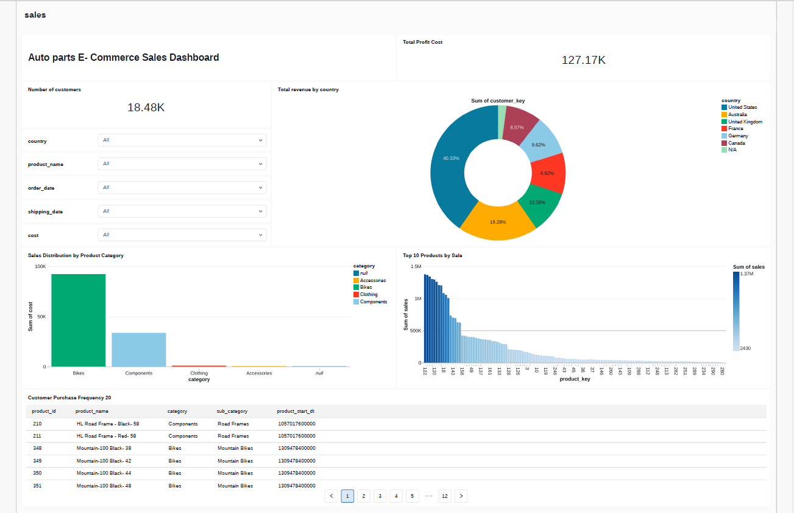

# DATA WAREHOUSE PROJECT 
## 📂 dashboards/
Contain export dashborads from the Databricks dashboards formatted in JSON and saved in pdf.

Majorly used to demonstrate the visual for business insights such as Revenue and sales.

## 📂 data_exports/
Organized by the strucre of Medallion Architecture layers.

Exported HTML view of the bronze, silver & Gold,  