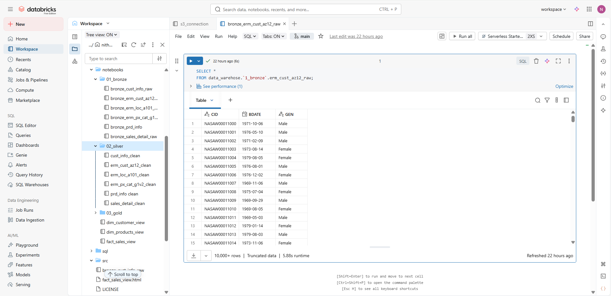
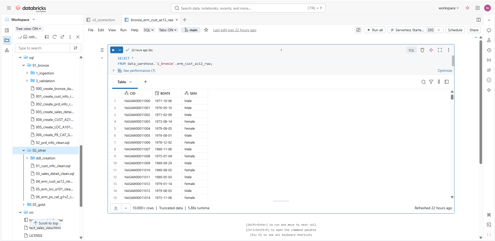

# DATA WAREHOUSE PROJECT 
## 📂 dashboards/
Contain export dashborads from the Databricks dashboards formatted in JSON and saved in pdf.

Majorly used to demonstrate the visual for business insights such as Revenue and sales.

## 📂 data_exports/
Organized by the strucre of Medallion Architecture layers.

Exported HTML view of the bronze, silver & Gold, for better understnading to view the table.

## 📂 datasets/

Conatins raw data of CRM & ERM csv file for the sample demonstration and for local testing and devlopement purposes.

## 📂 docs/
### 📂 00WarehouseDiagram.drawio.png/ 
        Contains the flow diagram with over all setup and orchetran, storage and scripts which we used in our project.
### 📂 01Data Model2.drawio.png/
        Explain the medallian architure opf our project with diagrmatical view
### 📂 02Mermaid flowchart code.png/
        Flow represent the data of the project with primary key and foreign key we used.

## 📂 notebooks/
Organized by Medallion layer with ingestion-> Transformation-> Dashboard

### 📂 01_silver/ 
### 📂 02_bronze/ 
### 📂 03_gold/ 

## 📂 sql/

### 📂 01_silver/ ### 
      includes ingestion , DDL creation & validation 
### 📂 02_bronze/ ### 
      includes DDL creation , Transformation and cleaning scripts 
### 📂 03_gold/ ### 
      includes aggregation ,business logics 

